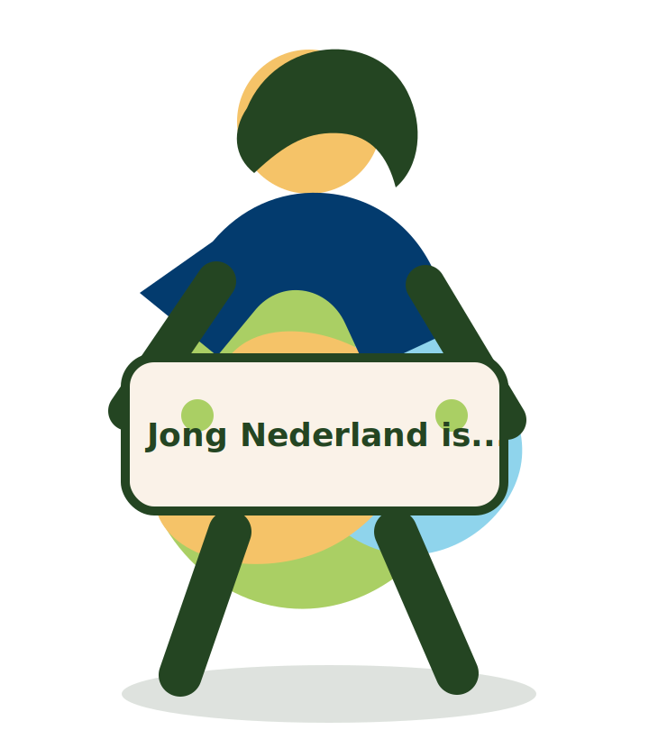

# Jong Nederland homepage demo

Losse HTML/CSS/JS demo voor GitHub + Netlify.

## Bestanden

- `index.html`
- `styles.css`
- `script.js`
- `images/logo-mark.png`
- `images/hero-kind-placeholder.svg`

## Laatste wijzigingen

- Polaroid-fotocollage in de hero verwijderd.
- Hero aangepast naar een vrijstaand kind/karakter met bordje.
- Wisselende woorden toegevoegd: spelen, vies worden, lachen, ontdekken, maken, vrienden.
- Menu gebruikt nu het geüploade Jong Nederland beeldmerk.

## Eigen afbeeldingen gebruiken

Zet nieuwe afbeeldingen in:

```txt
/images/
```

Vervang in `index.html` bijvoorbeeld:

```html

```

Door:

```html

```

Beste resultaat: vrijstaande PNG/WebP met transparante achtergrond.
